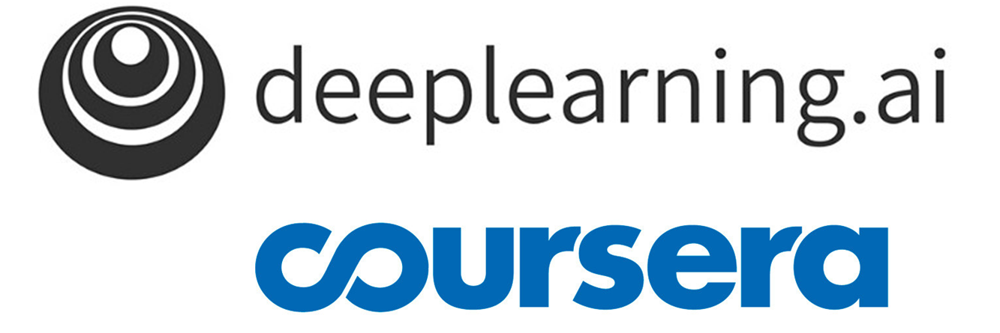
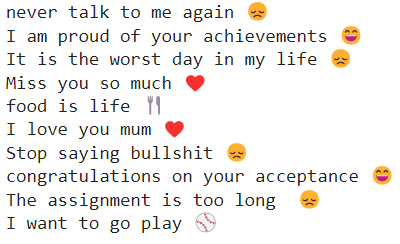
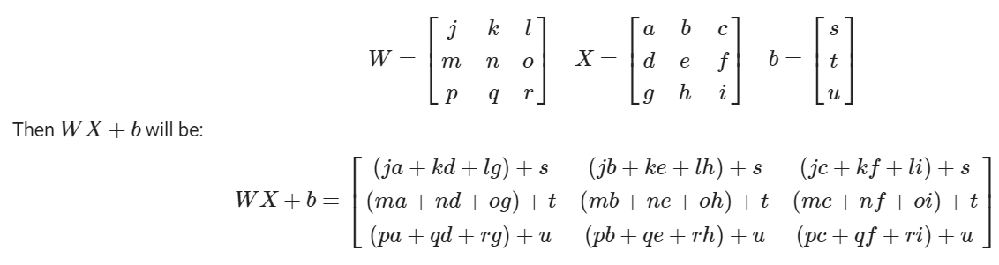
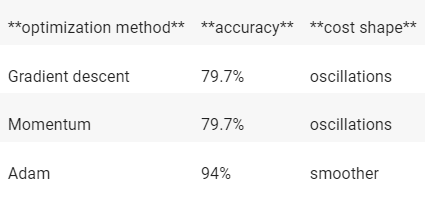
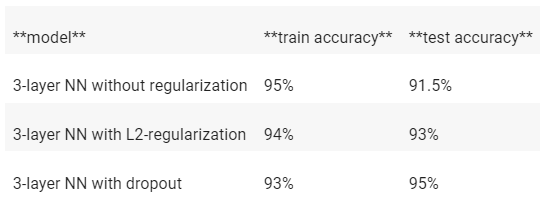
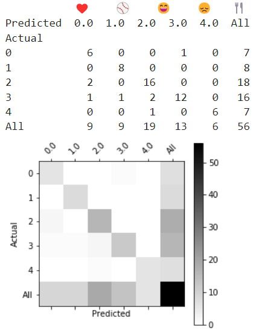
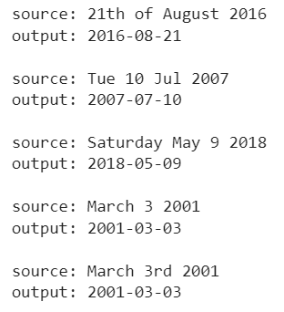
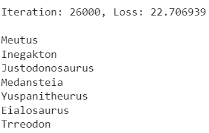

# Deep-Learning-Specialization---Coursera
This repository includes all tasks' notebooks created as part of Coursera's [Deep Learning Specialization course](https://www.coursera.org/specializations/deep-learning).

The Deep Learning Specialization is a foundational program that teaches the capabilities, challenges, and consequences of deep learning and prepares to participate in the development of leading-edge AI technology. 
In this Specialization, I built and trained neural network architectures such as Convolutional Neural Networks, Recurrent Neural Networks, LSTMs, Transformers, and learnt how to make them better with strategies such as Dropout, BatchNorm, Xavier/He initialization, and more. Theoretical concepts and their industry applications are 
taught using Python and TensorFlow. Real-world cases were tackled such as speech recognition, music synthesis, chatbots, machine translation, natural language processing, and more.

  
  
  

## Tasks

### Building Deep Neural Network Step by Step | [notebook](1/notebooks/Building_Deep_Neural_Network_Step_by_Step.ipynb) | [py file](1/py_files/Building_Deep_Neural_Network_Step_by_Step.py) - 
Build a deep neural network from scratch.
Implementation of all the functions required to build a deep neural network. Use non-linear units like ReLU to improve NN model, build a deeper neural network (with more than 1 hidden layer) and implement an easy-to-use Neural Network class.

### Deep Neural Network for Image Classification Application | [notebook](1/notebooks/Deep_Neural_Network_for_Image_Classification_Application.ipynb) | [py file](1/py_files/Deep_Neural_Network_for_Image_Classification_Application.py) - 
building a deep network, and applying it to cat vs non-cat classification. Build and apply a deep neural network to supervised learning.

### Gradient Checking | [notebook](2/notebooks/Gradient_Checking.ipynb) | [py file](2/py_files/Gradient_Checking.py) - 
Implement and use Gradient Checking.
Be certain that the implementation of the backpropagation process is correct.

### Optimization methods | [notebook](2/notebooks/Optimization_methods.ipynb) | [py file](2/py_files/Optimization_methods.py) - 
More advanced optimization methods that can speed up learning and perhaps even get a better final value for the cost function. Having a good optimization algorithm can be the difference between waiting days vs. just a few hours to get a good result. Stochastic Gradient Descent,  Mini-Batch Gradient Descent, Momentum, Adam.

### Regularization | [notebook](2/notebooks/Regularization.ipynb) | [py file](2/py_files/Regularization.py) - 
Deep Learning models have so much flexibility and capacity that overfitting can be a serious problem, if the training dataset is not big enough. the learned network colud do well on the training set, but to don't generalize to new examples that it has never seen. Regularization Methods in deep learning models - L2 Regularization, Dropout

### TensorFlow_Tutorial | [notebook](2/notebooks/TensorFlow_Tutorial.ipynb) | [py file](2/py_files/TensorFlow_Tutorial.py) - 
Working with TensorFlow:
- Initialize variables
- Start your own session
- Train algorithms
- Implement a Neural Network

### Art Generation with Neural Style Transfer | [notebook](3/notebooks/Art_Generation_with_Neural_Style_Transfer.ipynb) | [py file](3/py_files/Art_Generation_with_Neural_Style_Transfer.py) - 
This algorithm was created by [Gatys et al. (2015)](https://arxiv.org/abs/1508.06576).
Implement the Neural Style Transfer algorithm. Generate novel artistic images using the algorithm.
Most of the algorithms optimize a cost function to get a set of parameter values. In Neural Style Transfer, the algorithm optimizes a cost function to get pixel values.

### Autonomous Driving Application - Car Detection using YOLO | [notebook](1/notebooks/Autonomous_driving_application_Car_detection_YOLO.ipynb) | [py file](1/py_files/Autonomous_driving_application_Car_detection_YOLO.py) - 
Object Detection using the powerful YOLO model. Use object detection on a car detection dataset. Deal with bounding boxes.

### Convolution Model Application - SIGNS Dataset - Hand Signs Images to Numbers Classifications | [notebook](1/notebooks/Convolution_model_Application_-_SIGNS_dataset_-_hand_signs_images_to_numbers_classifications.ipynb) | [py file](1/py_files/Convolution_model_Application_-_SIGNS_dataset_-_hand_signs_images_to_numbers_classifications.py) - 
Implement a fully functioning ConvNet using TensorFlow. Build and train a ConvNet in TensorFlow for a classification problem. 
Built a model that recognizes SIGN language, the SIGNS dataset is a collection of 6 signs representing numbers from 0 to 5.

### Face Recognition, Face_Verification and Triplet Loss Function | [notebook](1/notebooks/Face_Recognition_Face_Verification_Triplet_Loss_Function.ipynb) | [py file](1/py_files/Face_Recognition_Face_Verification_Triplet_Loss_Function.py) - 
A face recognition system. Face recognition problems commonly fall into two categories:
 - Face Verification - A 1:1 matching problem. "is this the claimed person?". For example: A mobile phone that unlocks using your face is using face verification. 
 - Face Recognition - A 1:K matching problem. "who is this person?".
Implement the triplet loss function. Use a pretrained model to map face images into 128-dimensional encodings. Use these encodings to perform face verification and face recognition.

### Building a Recurrent Neural Network Step by Step | [notebook](4/notebooks/Building_a_Recurrent_Neural_Network_Step_by_Step.ipynb) | [py file](4/py_files/Building_a_Recurrent_Neural_Network_Step_by_Step.py) - 
Implement key components of a Recurrent Neural Network in numpy.
Recurrent Neural Networks (RNN) are very effective for Natural Language Processing and other sequence tasks because they have "memory". They can read inputs x⟨t⟩  (such as words) one at a time, and remember some information/context through the hidden layer activations that get passed from one time-step to the next. This allows a unidirectional RNN to take information from the past to process later inputs. A bidirectional RNN can take context from both the past and the future.

### Character Level Language Model - Dinosaurus Names, Writing like Shakespeare | [notebook](4/notebooks/Character_Level_Language_Model-Dinosaurus_names_Writing_Like_Shakespeare.ipynb) | [py file](4/py_files/Character_Level_Language_Model-Dinosaurus_names_Writing_Like_Shakespeare.py)  - 
build a character level language model to generate new dinosaur names. The algorithm learns the different name patterns, and randomly generates new names.
Store text data for processing using an RNN. Synthesize data, by sampling predictions at each time step and passing it to the next RNN-cell unit. Build a character-level text generation Recurrent Neural Network.

### Emojify Word Vectors Representations | [notebook](4/notebooks/Emojify_Word_Vectors_Representations.ipynb) | [py file](4/py_files/Emojify_Word_Vectors_Representations.py)  - 
Implement a model which inputs a sentence (such as "Let's go see the baseball game tonight!") and finds the most appropriate emoji to be used with this sentence (⚾️). Start with a baseline model (Emojifier-V1) using word embeddings. Implement a more sophisticated model (Emojifier-V2) that further incorporates an LSTM.
Example:
Rather than writing: "Congratulations on the promotion! Let's get coffee and talk. Love you!"
The emojifier can automatically turn this into: "Congratulations on the promotion! 👍 Let's get coffee and talk. ☕️ Love you! ❤️"

### Improvise a Jazz_Solo with an LSTM Network | [notebook](4/notebooks/Improvise_a_Jazz_Solo_with_an_LSTM_Network.ipynb) | [py file](4/py_files/Improvise_a_Jazz_Solo_with_an_LSTM_Network.py)  - 
Implement a model that uses an LSTM to generate music. Apply an LSTM to music generation. Generate jazz music with deep learning.

### Neural Machine Translation with Attention | [notebook](4/notebooks/Neural_Machine_Translation_with_Attention.ipynb) | [py file](4/py_files/Neural_Machine_Translation_with_Attention.py)  - 
build a Neural Machine Translation (NMT) model to translate human-readable dates ("25th of June, 2009") into machine-readable dates ("2009-06-25") using an attention model, one of the most sophisticated sequence-to-sequence models.

### Operations on Word Vectors - Word Embedding | [notebook](4/notebooks/Operations_on_Word_Vectors-Word_Embedding.ipynb) | [py file](4/py_files/Operations_on_Word_Vectors-Word_Embedding.py)  - 
Load pre-trained word vectors, and measure similarity using cosine similarity. Use word embeddings to solve word analogy problems such as "Man is to Woman as King is to \_\_\_". Modify word embeddings to reduce their gender bias.

---

  
  
  
  
  
  

