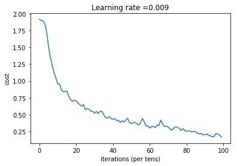

# Deep-Learning-Specialization---Coursera
This repository includes all tasks' notebooks created as part of Coursera's [Deep Learning Specialization course](https://www.coursera.org/specializations/deep-learning).

The Deep Learning Specialization is a foundational program that teaches the capabilities, challenges, and consequences of deep learning and prepares to participate in the development of leading-edge AI technology. 
In this Specialization, I built and trained neural network architectures such as Convolutional Neural Networks, Recurrent Neural Networks, LSTMs, Transformers, and learnt how to make them better with strategies such as Dropout, BatchNorm, Xavier/He initialization, and more. Theoretical concepts and their industry applications are 
taught using Python and TensorFlow. Real-world cases were tackled such as speech recognition, music synthesis, chatbots, machine translation, natural language processing, and more.

  
  
  

## Tasks

### Building Deep Neural Network Step by Step | [notebook](1/notebooks/Building_Deep_Neural_Network_Step_by_Step.ipynb) | [py file](1/py_files/Building_Deep_Neural_Network_Step_by_Step.py)  - 

### Deep Neural Network for Image Classification Application | [notebook](1/notebooks/Deep_Neural_Network_for_Image_Classification_Application.ipynb) | [py file](1/py_files/Deep_Neural_Network_for_Image_Classification_Application.py)  - 

### Gradient Checking | [notebook](2/notebooks/Gradient_Checking.ipynb) | [py file](2/py_files/Gradient_Checking.py)  - 

### Optimization methods | [notebook](2/notebooks/Optimization_methods.ipynb) | [py file](2/py_files/Optimization_methods.py)  - 

### Regularization | [notebook](2/notebooks/Regularization.ipynb) | [py file](2/py_files/Regularization.py)  - 

### TensorFlow_Tutorial | [notebook](2/notebooks/TensorFlow_Tutorial.ipynb) | [py file](2/py_files/TensorFlow_Tutorial.py)  - 

### Art Generation with Neural Style Transfer | [notebook](3/notebooks/Art_Generation_with_Neural_Style_Transfer.ipynb) | [py file](3/py_files/Art_Generation_with_Neural_Style_Transfer.py)  - 

### Autonomous Driving Application - Car Detection using YOLO | [notebook](1/notebooks/Autonomous_driving_application_Car_detection_YOLO.ipynb) | [py file](1/py_files/Autonomous_driving_application_Car_detection_YOLO.py)  - 

### Convolution Model Application - SIGNS Dataset - Hand Signs Images to Numbers Classifications | [notebook](1/notebooks/Convolution_model_Application_-_SIGNS_dataset_-_hand_signs_images_to_numbers_classifications.ipynb) | [py file](1/py_files/Convolution_model_Application_-_SIGNS_dataset_-_hand_signs_images_to_numbers_classifications.py)  - 

### Face Recognition, Face_Verification and Triplet Loss Function | [notebook](1/notebooks/Face_Recognition_Face_Verification_Triplet_Loss_Function.ipynb) | [py file](1/py_files/Face_Recognition_Face_Verification_Triplet_Loss_Function.py)  - 

### Building a Recurrent Neural Network Step by Step | [notebook](4/notebooks/Building_a_Recurrent_Neural_Network_Step_by_Step.ipynb) | [py file](4/py_files/Building_a_Recurrent_Neural_Network_Step_by_Step.py)  - 

### Character Level Language Model - Dinosaurus Names, Writing like Shakespeare | [notebook](4/notebooks/Character_Level_Language_Model-Dinosaurus_names_Writing_Like_Shakespeare.ipynb) | [py file](4/py_files/Character_Level_Language_Model-Dinosaurus_names_Writing_Like_Shakespeare.py)  - 

### Emojify Word Vectors Representations | [notebook](4/notebooks/Emojify_Word_Vectors_Representations.ipynb) | [py file](4/py_files/Emojify_Word_Vectors_Representations.py)  - 

### Improvise a Jazz_Solo with an LSTM Network | [notebook](4/notebooks/Improvise_a_Jazz_Solo_with_an_LSTM_Network.ipynb) | [py file](4/py_files/Improvise_a_Jazz_Solo_with_an_LSTM_Network.py)  - 

### Neural Machine Translation with Attention | [notebook](4/notebooks/Neural_Machine_Translation_with_Attention.ipynb) | [py file](4/py_files/Neural_Machine_Translation_with_Attention.py)  - 

### Operations on Word Vectors - Word Embedding | [notebook](4/notebooks/Operations_on_Word_Vectors-Word_Embedding.ipynb) | [py file](4/py_files/Operations_on_Word_Vectors-Word_Embedding.py)  - 

